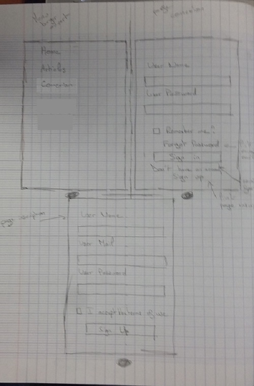

# Blog-model  

## Exercice:  

Dans cet exercice, nous allons créer un blog "modèle".
Nous utiliserons pour la création :  
- **HTML**
- **CSS**
- **GRID**
- **JS**

Celui-ci devra contenir :  
- 1 page d'acceuil
- 1 page de connexion
- 1 page d'inscription
- 1 page avec les articles (une dizaine)

De plus, il devra être responsive "mobil first".

## Cheminement création blog: 

### Etape 1 :  

- Maquette papier :  

### Etape 2 :  

- Préparer le squelette principale du site sur le fichier index.html
- Linker le fichier script.js dans le fichier index.html
- Linker le fichier styles.css dans le fichier index.html
- Faire une mise en forme générale du site avec le styles.css
- Remplir au fur et à mesure le readme.md

### Etape 3 :  

- Faire une pagination de 10 articles sur 2 pages (fichier allArticlesP1 et allArticlesP2)
- Faire une page "Article"
- Faire une page "Connexion"
- Faire une page "Inscription"
- Linker les pages entre-elles

### Etape 4 :  

- Faire mise en forme "mobil first"
- Faire media query

### Etape 5 :  

- Présenter la maquette au client

## TODO: 

- Etape 1 : fait  
- Etape 2 : fait
- Etape 3 : fait
- Etape 4 : mobil first fait, media query en cours
- Etape 5 : fait